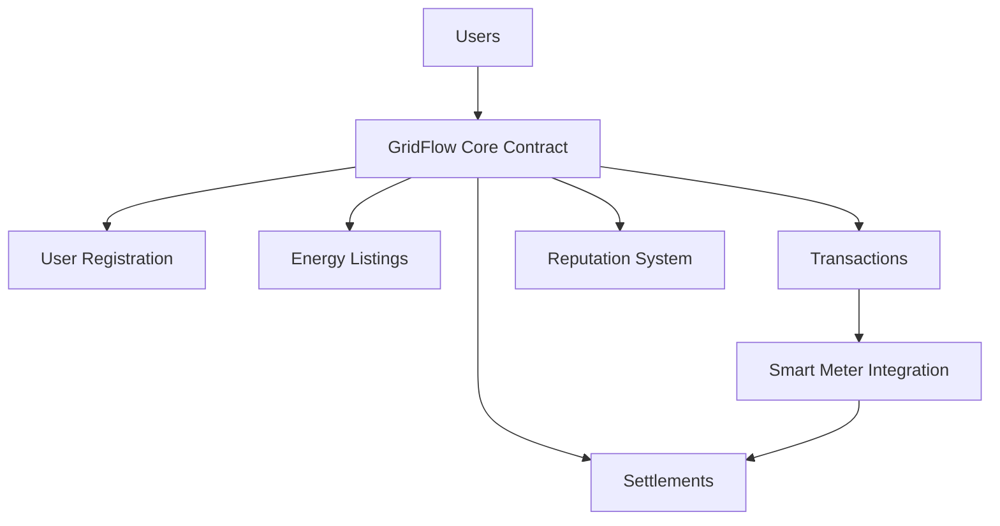

# GridFlow Energy Network

A decentralized platform enabling peer-to-peer energy trading and distribution between renewable energy producers and consumers.

## Overview

GridFlow Energy Network revolutionizes energy distribution by creating a decentralized marketplace where households with renewable energy sources can trade directly with energy consumers. The platform facilitates automated matching, smart metering integration, and transparent transaction settlement.

### Key Features
- Peer-to-peer energy trading
- User registration as producers and/or consumers
- Automated energy listing and matching
- Smart meter integration for settlement
- Reputation system for reliability
- Transparent transaction records

## Architecture

The GridFlow platform is built on a smart contract architecture that manages energy trading and user interactions.



### Core Components
1. User Management System
2. Energy Listing Marketplace
3. Transaction Processing
4. Settlement System
5. Reputation Tracking

## Contract Documentation

### GridFlow Core Contract
The main contract managing all platform functionality.

#### Key Data Structures
- `users`: Stores user profiles and roles
- `energy-listings`: Manages energy availability and pricing
- `energy-transactions`: Records energy trades
- `energy-settlements`: Tracks transaction settlements
- `user-reputation`: Maintains user reliability scores

#### Access Control
- Producer functions require producer role
- Consumer functions require consumer role
- Settlement functions require authorized entities
- Admin functions restricted to contract owner

## Getting Started

### Prerequisites
- Clarinet
- Stacks wallet

### Installation
1. Clone the repository
2. Install dependencies with Clarinet
3. Deploy contracts to desired network

### Basic Usage

1. Register as a user:
```clarity
(contract-call? .gridflow-core register-user u1 "LOCATION-ID")
```

2. Create an energy listing (producers):
```clarity
(contract-call? .gridflow-core create-energy-listing u1000 u50 u1000)
```

3. Purchase energy (consumers):
```clarity
(contract-call? .gridflow-core buy-energy u1 u500)
```

## Function Reference

### User Management
```clarity
(register-user (role uint) (location (string-ascii 50)))
(update-user-profile (role uint) (location (string-ascii 50)))
```

### Energy Trading
```clarity
(create-energy-listing (energy-amount uint) (price-per-unit uint) (expiration-time uint))
(buy-energy (listing-id uint) (energy-amount uint))
```

### Settlement
```clarity
(settle-transaction (transaction-id uint) (actual-energy-delivered uint))
```

### Reputation
```clarity
(submit-rating (transaction-id uint) (is-positive bool))
```

## Development

### Testing
Run the test suite:
```bash
clarinet test
```

### Local Development
1. Start Clarinet console:
```bash
clarinet console
```

2. Deploy contracts:
```bash
clarinet deploy
```

## Security Considerations

### Limitations
- Settlement currently relies on simplified authorization
- Price manipulation protection not implemented
- Energy delivery verification needs robust oracle integration

### Best Practices
1. Always verify transaction status before settlement
2. Implement proper error handling for all transactions
3. Monitor reputation scores for suspicious activity
4. Maintain appropriate energy listing expiration times
5. Verify smart meter readings through multiple sources